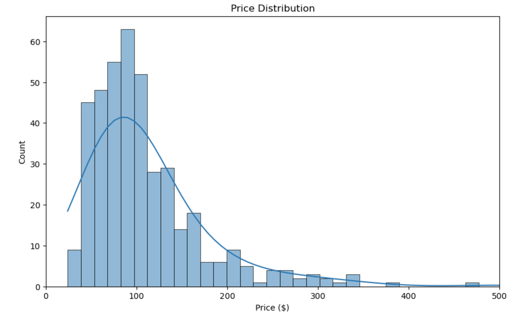
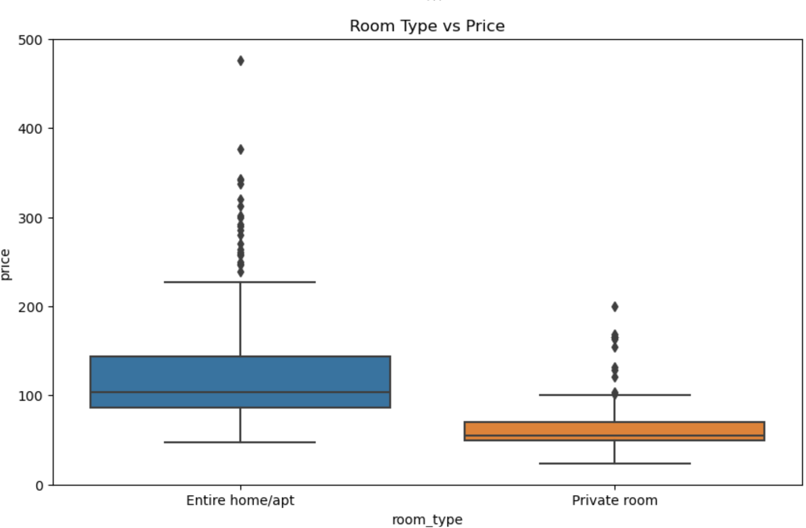
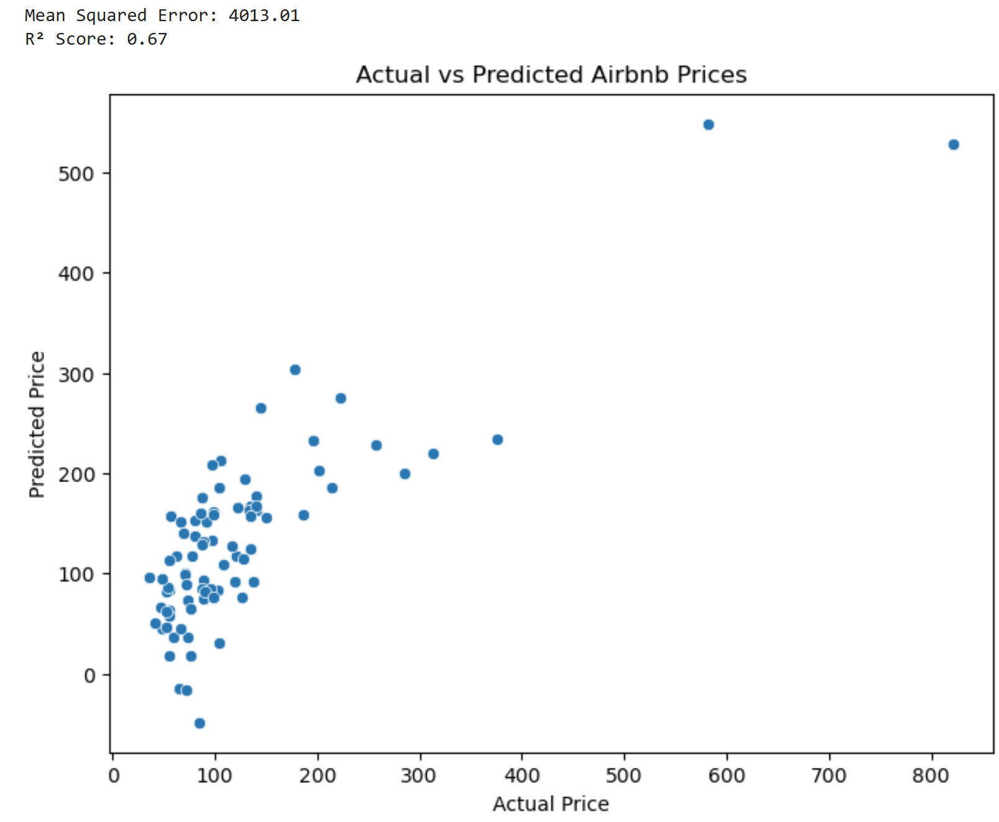

# Airbnb Price Prediction

This project is a machine learning model that predicts the nightly price of Airbnb listings in New York City using structured data, Artificial Intelligence (AI), and a linear regression model.

---

## Project Overview

This project explores a real-world dataset of Airbnb listings and builds a machine learning model using AI to estimate the price of a listing based on features such as number of bedrooms, room type, number of reviews, and availability.

What I did:
- Clean and preprocess the dataset
- Explore patterns with visualizations
- Train a regression model
- Evaluate its performance
- Discuss potential next steps (e.g. more features, better models, deployment)

---

## Project Structure

ML-Airbnb-Price-Prediction/  
|-- data/  
| --- listings.csv <- Raw dataset from Inside Airbnb  
|-- notebooks/  
| --- Airbnb_Price_Prediction.ipynb <- Jupyter notebook with full project  
|-- README.md <- You are reading it!  
|-- requirements.txt <- Python dependencies  
|-- .gitignore   

---

## Machine Learning Problem Type

- **Regression**: Predicting a continuous variable (`price`) from a list of inputs.

---

## Dataset Description

Dataset Source: [Inside Airbnb - NYC Listings](http://insideairbnb.com/get-the-data.html)

The dataset includes 70+ columns, but I selected a few key ones for this project:

| Column                | Description                                        |
|-----------------------|----------------------------------------------------|
| `accommodates`        | Number of people the listing can accommodate       |
| `bedrooms`            | Number of bedrooms                                 |
| `beds`                | Number of beds                                     |
| `minimum_nights`      | Minimum nights required for booking                |
| `number_of_reviews`   | Total number of reviews                            |
| `availability_365`    | Number of days the listing is available in a year  |
| `reviews_per_month`   | Average monthly review count                       |
| `room_type`           | Type of room (entire, private, shared)             |
| `price`               | **Target variable** — nightly price in USD         |

---

## How to Run the Project

### 1. Clone the Repository

git clone https://github.com/SiddheshwarTewari/ML-Airbnb-Price-Prediction.git  
cd ML-Airbnb-Price-Prediction  

### 2. Create a Virtual Environment (Optional but recommended)

python -m venv venv  
source venv/bin/activate or .\venv\Scripts\activate on Windows  

### 3. Install Dependencies

pip install -r requirements.txt

OR   
install manually: pip install pandas numpy matplotlib seaborn scikit-learn jupyter

### 4. Run Jupyter Notebook

jupyter notebook

## Model Overview

### Model Used:

Linear Regression (from scikit-learn)

### Performance:

MSE (Mean Squared Error): 4,013  
R² Score: 0.67  

This is a baseline model to demonstrate regression concepts. You can improve it by:
1. Using more advanced models 
2. Using more parameter details
3. Log-transforming targets/points that are outliers

## Sample Visualizations

### Price Distribution

### Room Type vs Price

### Actual vs Predicted Price

## Possible Improvements

1. Add geolocation data (latitude/longitude -> borough encoding or clustering)
2. Log-transform price for better distribution
3. Try tree-based models like XGBoost or LightGBM
4. Deploy the model via Streamlit or Flask

